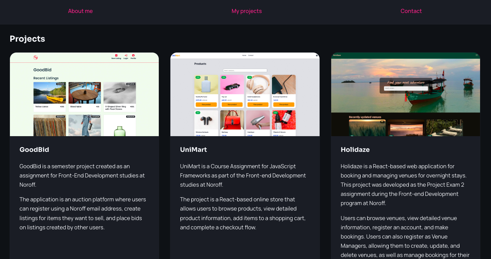

# Veronika's Portfolio



A personal portfolio website showcasing my front-end development projects and contact information.

## Description

This portfolio was created as part of my Front-End Development studies at Noroff as a course assignment.

The application is built as a responsive single-page website with navigation between sections and a clean design.

The application includes:

- Personal introduction section
- Project showcase with screenshots, descriptions, and technology stacks
- Links to GitHub repositories and live project demos
- Contact section with links
- Responsive design for desktop and mobile devices

## Built with

- React
- JavaScript
- CSS Modules

## Getting started

### Installing

1. Clone the repository:

```bash
git clone git@github.com:VReinhaug/portfolio-2.git
```

2. Install the dependencies:

```bash
npm install
```

### Running

To run the application locally:

```bash
npm start
```

## Contact

[LinkedIn](https://www.linkedin.com/in/veronika-reinhaug/)
